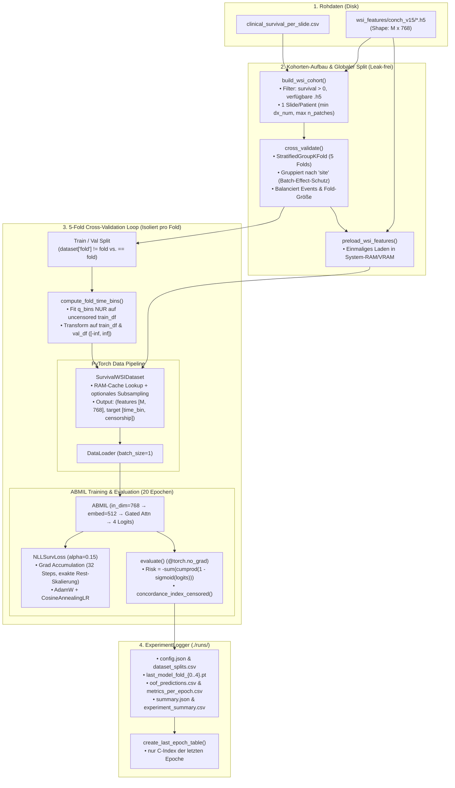

# Multimodal & WSI Survival Prediction Pipeline

## Pipeline-Architektur

```mermaid
flowchart TD
    subgraph Input["1. Rohdaten (Disk)"]
        CSV["clinical_survival_per_slide.csv"]
        H5["wsi_features/conch_v15/*.h5<br/>(Shape: M x 768)"]
    end

    subgraph Prep["2. Kohorten-Aufbau & Globaler Split (Leak-frei)"]
        BWC["build_wsi_cohort()<br/>• Filter: survival > 0, verfügbare .h5<br/>• 1 Slide/Patient (min dx_num, max n_patches)"]
        CV["cross_validate()<br/>• StratifiedGroupKFold (5 Folds)<br/>• Gruppiert nach 'site' (Batch-Effect-Schutz)<br/>• Balanciert Events & Fold-Größe"]
        CACHE["preload_wsi_features()<br/>• Einmaliges Laden in System-RAM/VRAM"]
    end

    CSV --> BWC
    H5 --> BWC
    BWC --> CV
    CV --> CACHE
    H5 --> CACHE

    subgraph FoldLoop["3. 5-Fold Cross-Validation Loop (Isoliert pro Fold)"]
        SPLIT["Train / Val Split<br/>(dataset['fold'] != fold vs. == fold)"]
        BINS["compute_fold_time_bins()<br/>• Fit q_bins NUR auf uncensored train_df<br/>• Transform auf train_df & val_df ([-inf, inf])"]
        
        subgraph DataLoad["PyTorch Data Pipeline"]
            DS["SurvivalWSIDataset<br/>• RAM-Cache Lookup + optionales Subsampling<br/>• Output: (features [M, 768], target [time_bin, censorship])"]
            DL["DataLoader (batch_size=1)"]
        end

        subgraph TrainEval["ABMIL Training & Evaluation (20 Epochen)"]
            MODEL["ABMIL (in_dim=768 → embed=512 → Gated Attn → 4 Logits)"]
            LOSS["NLLSurvLoss (alpha=0.15)<br/>• Grad Accumulation (32 Steps, exakte Rest-Skalierung)<br/>• AdamW + CosineAnnealingLR"]
            EVAL["evaluate() (@torch.no_grad)<br/>• Risk = -sum(cumprod(1 - sigmoid(logits)))<br/>• concordance_index_censored()"]
        end

        SPLIT --> BINS --> DS --> DL
        CACHE --> DS
        DL --> MODEL --> LOSS
        MODEL --> EVAL
    end

    CV --> SPLIT

    subgraph Logging["4. ExperimentLogger (./runs/)"]
        LOGS["• config.json & dataset_splits.csv<br/>• last_model_fold_{0..4}.pt<br/>• oof_predictions.csv & metrics_per_epoch.csv<br/>• summary.json & experiment_summary.csv"]
        TABLE["create_last_epoch_table()<br/>• nur C-Index der letzten Epoche"]
    end

    EVAL --> LOGS --> TABLE
```
